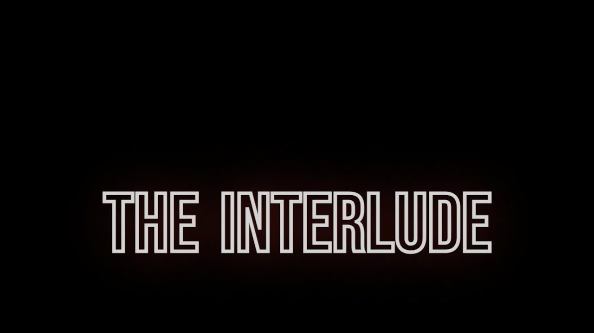
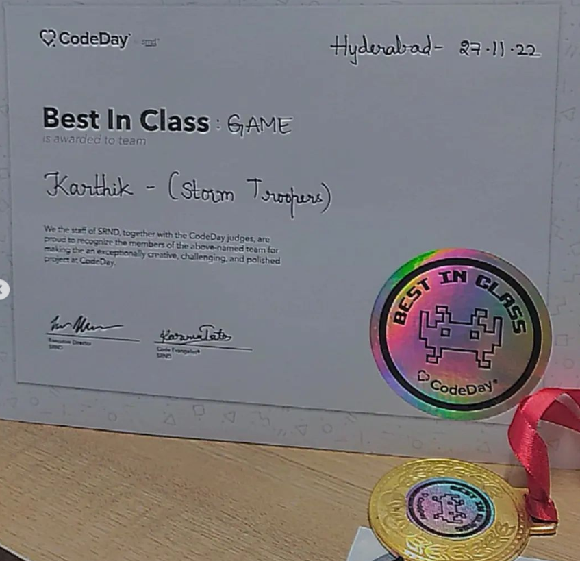
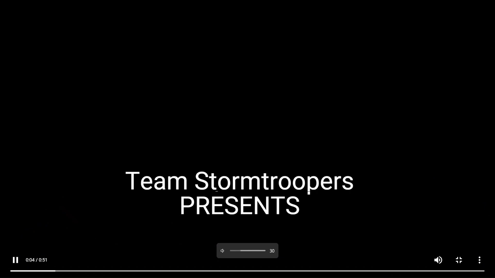
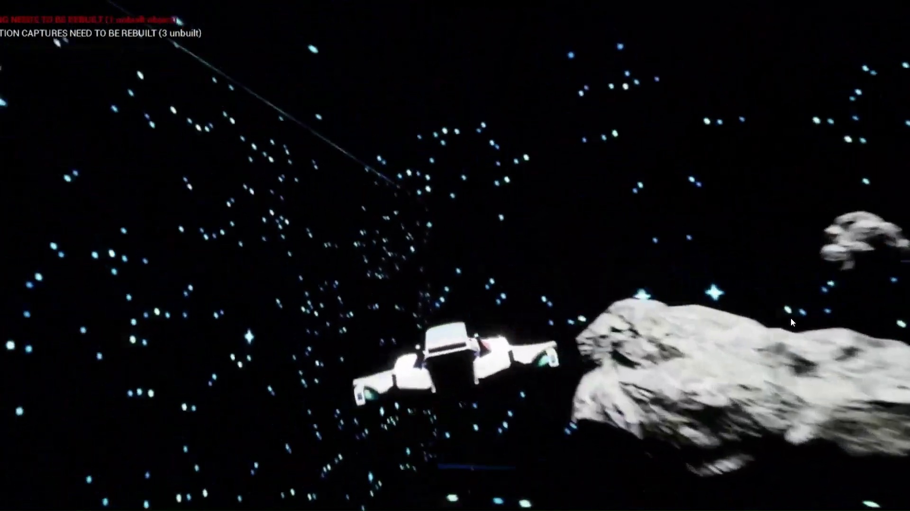
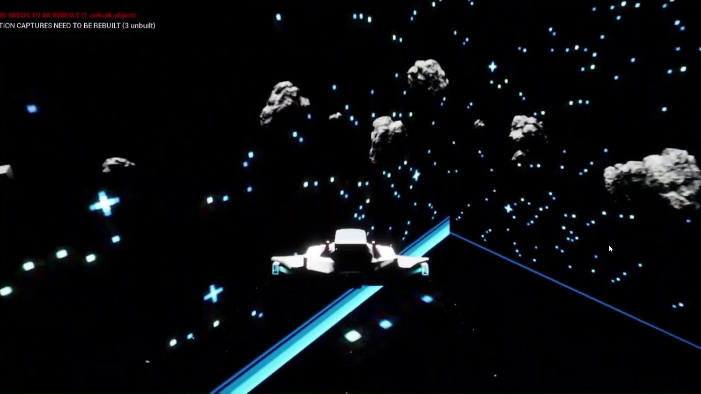
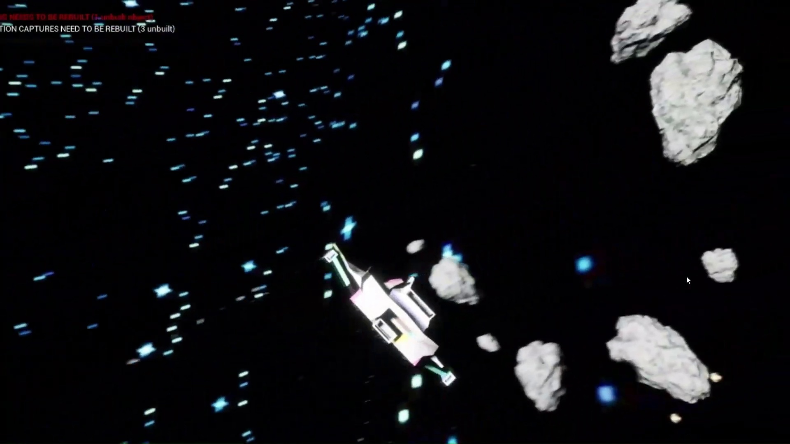

# The Interlude: 6-DOF Orbital Space Combat

<div align="center">
  <p align="center">
    
    
    
    <a href="https://karthikveeranala.github.io/portfolio/">
      
    </a>
  </p>

  

  <p align="center">
    <br>
    <a href="Media/Videos/the_interlude_trailer.mp4">
      <strong>[Watch Gameplay Trailer: Media/Videos/the_interlude_trailer.mp4]</strong>
    </a>
    &bull;
    <a href="https://karthikveeranala.github.io/portfolio/demo-reel/">
      <strong>[Watch on Portfolio Demo Reel]</strong>
    </a>
  </p>
</div>

---

## Overview

**The Interlude** is a 6-Degrees-of-Freedom (6-DOF) zero-gravity orbital space combat simulator developed during the 48-hour **CodeDay 2.0** hackathon, winning **1st Place Overall Winner**.

Taking flight inside an agile aerospace fighter in deep orbital space, the player engages hostile drone interceptors and automated cruisers in high-speed zero-g dogfights. The flight system models Newtonian inertia, directional RCS thruster pulses, and momentum conservation across unconstrained three-dimensional space.

---

## Accolades

<div align="center">
  
  <p><em>Official CodeDay 2.0 — 1st Place Overall Winner Certificate</em></p>
</div>

---

## Gameplay Demonstration

A high-definition trailer capture demonstrating zero-g flight maneuvers, laser combat, and orbital dogfighting is included in the repository:

- Local File: [Media/Videos/the_interlude_trailer.mp4](Media/Videos/the_interlude_trailer.mp4)
- Web Demo Reel: [karthikveeranala.github.io/portfolio/demo-reel/](https://karthikveeranala.github.io/portfolio/demo-reel/)

---

## Flight Physics & Combat Engineering

### 1. 6-DOF Newtonian Flight Mechanics
- **Unconstrained 3D Motion**: Independent 6-axis control covering Pitch, Yaw, Roll, Forward/Reverse Throttle, Lateral Strafe, and Vertical Lift.
- **Inertial Conservation**: Turning does not automatically redirect flight momentum; players maintain velocity vectors unless counter-thrust or flight-assist dampeners are engaged.
- **Boost Acceleration**: High-G afterburner thrusters providing rapid velocity spikes for break-away evasive maneuvers.

### 2. Laser Ballistics & Target Acquisition
- **High-Velocity Projectiles**: Laser projectiles calculate leading target reticles based on relative target velocity and distance vectors.
- **Impulse Collisions**: Laser strikes transfer physical kinetic impulses to target debris and enemy ship hulls.

### 3. Interceptor AI State Machines
- **Autonomous Dogfight Behavior**: Enemy AI ships track player trajectories across 3D space, alternating between strafing runs, pursuit loops, and evasive barrel rolls upon sustaining hull damage.

---

## Screenshot Gallery

| Deep Space Engagement | Asteroid Belt Dogfight |
| :---: | :---: |
|  |  |

| Laser Fire & Target Tracking | High-Speed Orbital Vector |
| :---: | :---: |
|  |  |

<div align="center">
  
</div>

---

## Controls

| Action | Primary Input | Description |
| :--- | :--- | :--- |
| Pitch / Yaw | Mouse / Flight Stick | Orient ship nose vertically and horizontally |
| Roll Left / Right | Q / E | Rotate ship around longitudinal axis |
| Throttle Forward / Reverse | W / S | Forward thrust and reverse braking |
| Lateral Strafe | A / D | Horizontal thruster drift |
| Vertical Strafe | Space / Left Ctrl | Vertical thruster elevation and descent |
| Afterburner Boost | Left Shift | High-speed acceleration burst |
| Primary Lasers | Left Mouse Button | Rapid-fire forward plasma cannons |
| Pause / Menu | Esc | Pause flight simulation |

---

## Repository Structure

```
The_Interlude/
├── Config/                  # Flight input mappings and engine parameters
├── Content/
│   ├── Cinematics/          # Level sequences and opening cinematic cameras
│   ├── Flying/              # Core flight components and physics assets
│   ├── FlyingBP/            # Spaceship player and AI enemy blueprints
│   ├── Geometry/            # Space arena meshes and obstacles
│   ├── StarterContent/      # Core visual and material libraries
│   └── Level1.umap          # Primary zero-g orbital combat arena
├── Media/
│   ├── Art/                 # Title cards and orbital art assets
│   ├── Certificates/        # CodeDay 2.0 1st Place Winner Certificate
│   ├── Screenshots/         # High-resolution gameplay captures
│   └── Videos/              # Full gameplay demonstration trailer (MP4)
├── .gitignore               # Unreal Engine cache & build exclusions
├── The_Interlude.uproject   # Unreal Engine project descriptor (UE 5.6)
└── README.md                # Project documentation and flight overview
```

---

## Getting Started

### Prerequisites
- **Unreal Engine 5.6** (or compatible 5.x build)
- **Windows 10 / 11 (64-bit)**
- **DirectX 11 / 12 compatible GPU**

### Opening the Project
1. Clone the repository:
   ```bash
   git clone https://github.com/KarthikVeeranala/Interlude-Space-Shooter.git
   cd Interlude-Space-Shooter
   ```
2. Double-click `The_Interlude.uproject` to launch the project in Unreal Editor.
3. In the Content Browser, open `Content/Level1.umap`.
4. Click **Play in Editor (PIE)** to launch the starship.

---

## Developer & Accolades

- **Award**: 1st Place Overall Winner — CodeDay 2.0 Game Hackathon
- **Developer**: **Karthik Veeranala** (Game Developer & Designer)
- **Portfolio**: [karthikveeranala.github.io/portfolio](https://karthikveeranala.github.io/portfolio/)
- **LinkedIn**: [linkedin.com/in/karthikveeranala](https://www.linkedin.com/in/karthikveeranala/)
- **GitHub**: [@KarthikVeeranala](https://github.com/KarthikVeeranala)

---

<div align="center">
  <sub>Copyright 2024-2026 Karthik Veeranala. Developed during CodeDay 2.0.</sub>
</div>
